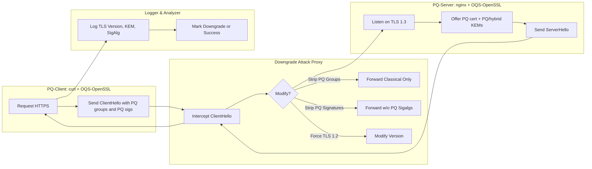

# Post-Quantum-TLS-Readiness-and-Downgrade-Attack-Simulator
Post‑Quantum TLS Readiness and Downgrade Attack Simulator

# Arch 

```mermaid
flowchart LR
    subgraph Client["PQ-Client: curl + OQS-OpenSSL"]
        C1["Request HTTPS"]
        C2["Send ClientHello with PQ groups and PQ sigs"]
    end

    subgraph MITM["Downgrade Attack Proxy"]
        M1["Intercept ClientHello"]
        M2{"Modify?"}
        M2 -->|Strip PQ Groups| M3["Forward Classical Only"]
        M2 -->|Strip PQ Signatures| M4["Forward w/o PQ Sigalgs"]
        M2 -->|Force TLS 1.2| M5["Modify Version"]
    end

    subgraph Server["PQ-Server: nginx + OQS-OpenSSL"]
        S1["Listen on TLS 1.3"]
        S2["Offer PQ cert + PQ/hybrid KEMs"]
        S3["Send ServerHello"]
    end

    subgraph Reporter["Logger & Analyzer"]
        R1["Log TLS Version, KEM, SigAlg"]
        R2["Mark Downgrade or Success"]
    end

    C1 --> C2 --> M1 --> M2 --> S1
    S1 --> S2 --> S3 --> M1 --> C1
    C1 --> R1 --> R2

```
