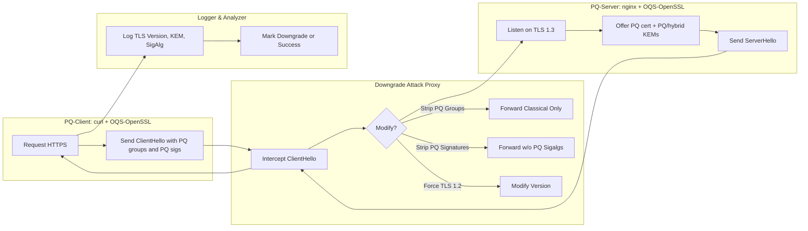

# Post-Quantum TLS Readiness & Downgrade Attack Simulator

This project simulates TLS 1.3/1.4 handshakes with support for both classical and post-quantum (PQ) cryptography, hybrid ciphersuites, and demonstrates advanced downgrade attacks. It is intended for educational, research, and interoperability testing purposes.

## Features (2025+)
- Simulate TLS 1.3, TLS 1.4, and PQ/hybrid handshakes
- Support for latest PQ algorithms (Kyber1024, Falcon-1024, Dilithium, hybrids)
- Model advanced downgrade attacks (strip PQ, strip hybrid, fake PQ, force legacy, etc.)
- Scenario-based simulation via JSON files
- Extensible cryptography, handshake, and MITM logic
- Simulate PQ certificates and certificate attacks
- Enhanced client/server policy (require PQ, require hybrid, etc.)
- Network simulation (latency, loss, reordering)
- Detailed logging and analytics (JSON/CSV output)
- Interoperability simulation (OpenSSL, BoringSSL, WolfSSL, etc.)
- Web dashboard for visualization (coming soon)

## Usage

```bash
python -m pq_tls_sim.cli --scenario scenarios/default.json --attack strip_hybrid_only
```

## Project Structure
- `pq_tls_sim/` - Main simulator code
- `scenarios/` - Example scenario files
- `tests/` - Test cases
- `dashboard/` - Web dashboard (optional)

## Requirements
- Python 3.8+

## License
MIT

---

# Architecture & Deployment (Legacy/Infra)



# Repository Layout (Legacy/Infra)
```bash
pq-tls-simulator/
├─ docker-compose.yml
├─ README.md
├─ .env.example
│
├─ server/
│ ├─ Dockerfile
│ ├─ nginx.conf
│ ├─ gen_pq_certs.sh
│ └─ entrypoint.sh
│
├─ client/
│ ├─ Dockerfile
│ ├─ run_test.sh
│ └─ entrypoint.sh
│
└─ mitm/
   ├─ Dockerfile
   ├─ proxy.py
   ├─ config.yml
   └─ requirements.txt
```
