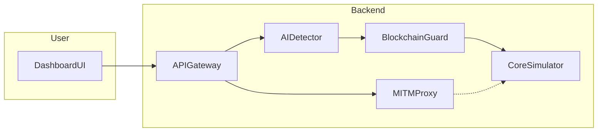
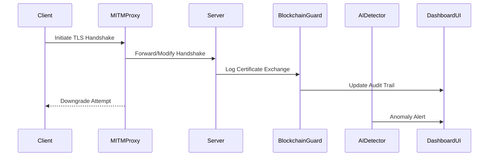
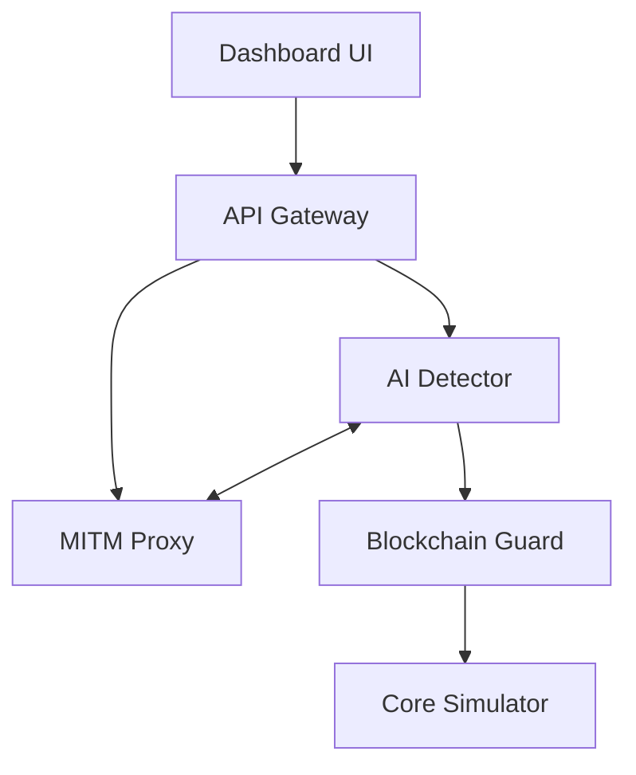
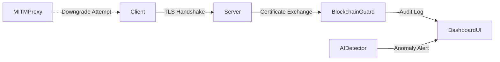

# Post-Quantum TLS Readiness & Downgrade Attack Simulator
# Overview
<div align="center">
  
  
  
  
</div>

<div align="center">
  
  
  
  
  
</div>

<div align="center">
  
</div>


## Executive Summary
Post-Quantum TLS Readiness & Downgrade Attack Simulator is an advanced framework for evaluating, simulating, and defending against cryptographic downgrade attacks in TLS environments, with a focus on post-quantum cryptography. It enables organizations, researchers, and security professionals to assess protocol resilience and readiness for quantum-era threats.

## Problem Statement
Modern TLS implementations are vulnerable to downgrade attacks, where adversaries force connections to use weaker cryptographic algorithms. As quantum computing advances, traditional cryptography faces obsolescence, and current systems lack robust mechanisms to evaluate post-quantum readiness and attack resilience. Existing tools are fragmented, lack automation, and do not provide comprehensive simulation or defense capabilities for post-quantum scenarios.

## Solution Overview
This project delivers a modular, extensible simulator and defense platform for post-quantum TLS environments. It integrates attack simulation, anomaly detection, blockchain-based audit trails, and real-time observability, enabling rigorous testing and validation of cryptographic protocols against downgrade and quantum-era threats. The system is designed for seamless integration into enterprise, academic, and research workflows.

## Key Features

| Feature | Description |
|---------|-------------|
| Downgrade Attack Simulation | Simulate and analyze cryptographic downgrade attacks in TLS and post-quantum environments |
| AI Anomaly Detection | Machine learning models for real-time protocol anomaly detection |
| Blockchain Audit | Immutable audit trails for handshake and certificate events |
| Modular Architecture | Plug-and-play modules for extensibility and integration |
| Real-Time Dashboard | Live monitoring, analytics, and reporting interface |
| Dockerized Deployment | Containerized services for reproducibility and scalability |
| RESTful API | Automation and integration with external systems |
| MITM Proxy | Adversarial testing and traffic interception |
| Logging & Metrics | Detailed event logs and performance metrics |


## System Architecture
---

### Component Interaction Diagram

```mermaid
flowchart LR
  subgraph User
    DashboardUI
  end
  subgraph Backend
    APIGateway
    AIDetector
    MITMProxy
    BlockchainGuard
    CoreSimulator
  end
  DashboardUI --> APIGateway
  APIGateway --> AIDetector
  APIGateway --> MITMProxy
  AIDetector --> BlockchainGuard
  BlockchainGuard --> CoreSimulator
  MITMProxy -.-> CoreSimulator
```
---

### High-Level System Flow

```mermaid
sequenceDiagram
  participant Client
  participant MITMProxy
  participant Server
  participant BlockchainGuard
  participant AIDetector
  participant DashboardUI
  Client->>MITMProxy: Initiate TLS Handshake
  MITMProxy->>Server: Forward/Modify Handshake
  Server->>BlockchainGuard: Log Certificate Exchange
  BlockchainGuard->>DashboardUI: Update Audit Trail
  MITMProxy-->>Client: Downgrade Attempt
  AIDetector->>DashboardUI: Anomaly Alert
```


The system is composed of modular services orchestrated via Docker Compose. Each module is independently deployable and communicates via secure APIs and message queues.

### Mermaid Architecture Diagram

```mermaid
flowchart TD
    DashboardUI[Dashboard UI]
    APIGateway[API Gateway]
    AIDetector[AI Detector]
    MITMProxy[MITM Proxy]
    BlockchainGuard[Blockchain Guard]
    CoreSimulator[Core Simulator]

    DashboardUI --> APIGateway
    APIGateway --> AIDetector
    APIGateway --> MITMProxy
    AIDetector <--> MITMProxy
    AIDetector --> BlockchainGuard
    BlockchainGuard --> CoreSimulator
```

**Modular Components:**
- `ai-detector`: AI-based anomaly detection
- `api`: RESTful API service
- `attacks`: MITM proxy and attack simulation
- `blockchain`: Audit and integrity verification
- `core`: Main simulation engine
- `dashboard`: Real-time monitoring UI
- `demo_app`: Sample integration application

---

## Graph Visualization & Analytics

The platform supports advanced graph-based analytics for protocol flows, attack paths, and anomaly detection. Graphs are rendered using integrated dashboard modules and can be exported for further analysis.

### Example: Protocol Flow Graph (Mermaid)

```mermaid
graph LR
    Client -->|TLS Handshake| Server
    Server -->|Certificate Exchange| BlockchainGuard
    BlockchainGuard -->|Audit Log| DashboardUI
    MITMProxy -.->|Downgrade Attempt| Client
    AIDetector -->|Anomaly Alert| DashboardUI
```

### Dashboard Graph Page
- Real-time visualization of:
  - Attack attempts and detection events
  - Protocol handshake flows
  - Blockchain audit trails
  - Anomaly scores and trends

Graphs and charts are accessible via the dashboard UI and can be customized for specific scenarios or exported for reporting.

## Technology Stack
**Languages:**
<p>
  
  
  
</p>

**Frameworks & Libraries:**
- Flask, FastAPI (API)
- Scikit-learn, TensorFlow (AI/ML)
- Hyperledger Fabric (Blockchain)
- Docker, Docker Compose

**Tools:**
- MITMProxy
- VS Code
- Git

**Platforms:**
- Linux (Primary)
- Docker

**Operating Systems:**
- Ubuntu, Debian, CentOS (Docker images)

## Installation & Setup
1. **Clone the Repository:**
   ```bash
   git clone https://github.com/rdxkeerthi/Post-Quantum-TLS-Readiness-and-Downgrade-Attack-Simulator.git
   cd Post-Quantum-TLS-Readiness-and-Downgrade-Attack-Simulator/pq-tls/pq-tls-blockchain-guard
   ```
2. **Install Docker & Docker Compose:**
   ```bash
   sudo apt-get update
   sudo apt-get install docker docker-compose
   ```
3. **Build and Start Services:**
   ```bash
   docker-compose up --build
   ```
4. **Verify Installation:**
   ```bash
   ./verify_installation.sh
   ```

## Usage Instructions
- **Run All Modes:**
  ```bash
  ./run_all_modes.sh
  ```
- **Start Dashboard:**
  ```bash
  cd dashboard
  ./MAIN_DASHBOARD_SETUP.sh
  ```
- **Simulate Attack:**
  ```bash
  cd attacks
  python mitm_proxy.py --simulate-downgrade
  ```
- **API Usage Example:**
  ```bash
  curl -X POST http://localhost:8000/api/simulate -d '{"type": "downgrade"}'
  ```

## Project Structure
```
pq-tls/
├── pq-tls-blockchain-guard/
│   ├── ai-detector/        # AI anomaly detection service
│   ├── api/               # RESTful API service
│   ├── attacks/           # MITM proxy and attack simulation
│   ├── blockchain/        # Blockchain audit and integrity
│   ├── core/              # Core simulation engine
│   ├── dashboard/         # Real-time monitoring UI
│   ├── demo_app/          # Sample integration app
│   ├── docs/              # Documentation
│   ├── infra/             # Infrastructure scripts
│   ├── tests/             # Test cases and scenarios
│   └── docker-compose.yml # Service orchestration
├── pq-tls-simulator/      # Simulator scripts and configs
├── tls-v2/                # TLS v2 reference implementation
└── data/                  # Sample data and logs
```

## Results / Output
- **Metrics:**
  - Downgrade attack detection rates
  - Anomaly scores and event logs
  - Blockchain audit trails
- **Reports:**
  - Security assessment summaries
  - Protocol resilience analytics
- **Dashboard:**
  - Real-time visualization of attack simulations and system status
- **Logs:**
  - Detailed handshake and protocol event logs

## Security & Best Practices
- Adherence to OWASP Secure Coding Guidelines
- Follows NIST SP 800-53 and ISO/IEC 27001 standards for cryptographic controls
- Implements defense-in-depth and least privilege principles
- Secure inter-service communication (TLS, mTLS)
- Regular code audits and static analysis

## Applications & Use Cases
- Enterprise security assessment and compliance
- Academic research in post-quantum cryptography
- Cyber defense and penetration testing
- Protocol development and validation
- Security operations and monitoring

## Limitations
- Quantum-resistant algorithms are subject to ongoing research and may evolve
- Simulator accuracy depends on protocol and attack model fidelity
- Resource-intensive for large-scale simulations
- Limited support for non-Linux platforms

## Future Enhancements
- Integration with additional post-quantum algorithms
- Support for cloud-native deployments (Kubernetes)
- Enhanced AI models for anomaly detection
- Automated compliance reporting
- Expanded dashboard analytics and visualization

## Contribution Guidelines
- Fork the repository and create a feature branch
- Follow the [CONTRIBUTING.md](pq-tls/pq-tls-simulator/CONTRIBUTING.md) guidelines
- Submit pull requests with detailed descriptions
- Adhere to code style and documentation standards
- Participate in code reviews and discussions

## License
This project is licensed under the MIT License. See the [LICENSE](LICENSE) file for details.

## Author / Maintainer
**Keerthi RDX**  
Lead Architect & Maintainer
