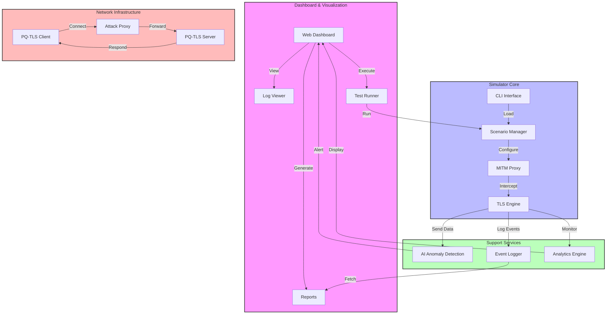
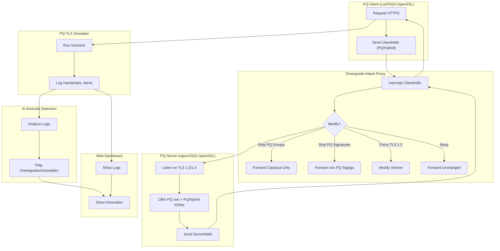

# Post-Quantum TLS Readiness & Downgrade Attack Simulator

This project simulates TLS 1.3/1.4 handshakes with support for both classical and post-quantum (PQ) cryptography, hybrid ciphersuites, and demonstrates advanced downgrade attacks. It is intended for educational, research, and interoperability testing purposes.

## 🚀 Features (2025+)
- Simulate TLS 1.3, TLS 1.4, and PQ/hybrid handshakes
- Support for latest PQ algorithms (Kyber1024, Falcon-1024, Dilithium, hybrids)
- Model advanced downgrade attacks (strip PQ, strip hybrid, fake PQ, force legacy, etc.)
- Scenario-based simulation via JSON files
- Extensible cryptography, handshake, and MITM logic
- Simulate PQ certificates and certificate attacks
- Enhanced client/server policy (require PQ, require hybrid, etc.)
- Network simulation (latency, loss, reordering)
- Detailed logging and analytics (JSON/CSV output)
- Interoperability simulation (OpenSSL, BoringSSL, WolfSSL, etc.)
- Web dashboard for visualization and monitoring
- AI-powered anomaly detection
- Blockchain-based event logging

## 🏗️ System Architecture



## 🛠️ Technical Stack
- **Backend**: Python 3.10+
- **Frontend**: Flask + HTML/CSS/JS
- **AI/ML**: Custom anomaly detection
- **Storage**: JSON/CSV + Blockchain
- **Containers**: Docker & Docker Compose
- **Testing**: pytest
- **Protocols**: TLS 1.3/1.4, Post-Quantum

## 🚀 Getting Started

### Prerequisites
1. Install Python 3.10 or higher
```bash
sudo apt update
sudo apt install python3.10 python3.10-venv
```

2. Install Docker and Docker Compose
```bash
sudo apt install docker.io docker-compose
```

3. Install OpenSSL with OQS support
```bash
git clone https://github.com/open-quantum-safe/openssl.git
cd openssl
./config --prefix=/usr/local/oqs-openssl
make -j$(nproc)
sudo make install
```

### Project Setup

1. Clone the repository
```bash
git clone https://github.com/rdxkeerthi/Post-Quantum-TLS-Readiness-and-Downgrade-Attack-Simulator.git
cd Post-Quantum-TLS-Readiness-and-Downgrade-Attack-Simulator
```

2. Create and activate virtual environment
```bash
python3 -m venv venv
source venv/bin/activate
```

3. Install dependencies
```bash
pip install -e .
pip install -r requirements.txt
```

4. Set up data directories
```bash
mkdir -p data/{logs,anomalies}
mkdir -p blockchain/data
```

### Configuration

1. Environment Variables
```bash
cp .env.example .env
# Edit .env with your settings
```

2. Update certificate paths in `server/nginx.conf`
```bash
cd server
./gen_pq_certs.sh  # Generate PQ certificates
```

## 📝 Usage Guide

### 1. Running with Docker (Recommended)

```bash
# Start all services
sudo docker compose up -d

# Access dashboard
open http://localhost:5000

# Check logs
docker compose logs -f

# Stop services
docker compose down
```

### 2. Running Locally

a) Start the Core Services:
```bash
# Terminal 1: Start TLS Server
cd server
./entrypoint.sh

# Terminal 2: Start MITM Proxy
cd mitm
python3 proxy.py

# Terminal 3: Start Dashboard
cd dashboard
python3 -m flask run
```

b) Run Test Scenarios:
```bash
# Basic scenario
python3 -m pq_tls_sim.cli --scenario scenarios/default.json

# With specific attack
python3 -m pq_tls_sim.cli --scenario scenarios/logjam.json --attack strip_hybrid_only

# Run all tests
python3 -m pytest tests/ --maxfail=3 -v
```

### 3. Development Mode

```bash
# Start with hot reload
FLASK_ENV=development FLASK_DEBUG=1 python3 -m flask run

# Run tests with coverage
pytest --cov=pq_tls_sim tests/
```

## 🌐 Web Dashboard Guide

### Dashboard Overview
The web dashboard provides a comprehensive interface for monitoring, analyzing, and managing PQ-TLS simulations in real-time.

### Accessing the Dashboard
```bash
# Method 1: Using Docker
docker compose up -d
open http://localhost:5000

# Method 2: Running Locally
cd dashboard
python3 -m flask run
```

### Dashboard Features

1. **Main Dashboard (/)**
   - System status overview
   - Active scenarios summary
   - Recent attack attempts
   - Real-time alerts
   - Performance metrics

2. **Handshake Logs (/logs)**
   - Real-time TLS handshake monitoring
   - Protocol version tracking
   - Cipher suite negotiations
   - Key exchange details
   - Certificate validations
   - Filter by:
     * Time range
     * Protocol version
     * Attack type
     * Success/Failure

3. **AI Anomaly Detection (/anomalies)**
   - Real-time threat detection
   - Pattern recognition results
   - Attack classification
   - Risk assessment scores
   - Historical analysis
   - Features:
     * ML-based detection
     * Behavior analysis
     * Trend visualization
     * Alert configuration

4. **Blockchain Events (/blockchain)**
   - Immutable event logging
   - Attack attempt records
   - Mitigation actions
   - Audit trail
   - Verification status
   - Export options:
     * JSON format
     * CSV reports
     * Audit logs

5. **Test Runner (/tests)**
   - Scenario management
   - Test case execution
   - Result analysis
   - Coverage reports
   - Features:
     * Batch testing
     * Custom scenarios
     * Real-time results
     * Performance metrics

6. **Reports (/report)**
   - Comprehensive analytics
   - Security assessments
   - Compliance status
   - Trend analysis
   - Export options:
     * PDF reports
     * Excel sheets
     * JSON/CSV data

### Real-World Applications

1. **Security Assessment**
   - Evaluate PQ readiness
   - Identify vulnerabilities
   - Test mitigation strategies
   - Validate security controls

2. **Compliance Testing**
   - NIST compliance checks
   - PQ migration readiness
   - Security policy validation
   - Audit trail maintenance

3. **Training and Education**
   - Security team training
   - Attack visualization
   - Hands-on experience
   - Scenario simulation

4. **Research and Development**
   - Protocol analysis
   - Algorithm testing
   - Performance benchmarking
   - Vulnerability research

### Dashboard Benefits

1. **Operational**
   - Real-time monitoring
   - Instant alerting
   - Automated reporting
   - Centralized management

2. **Security**
   - Proactive detection
   - Quick response
   - Threat intelligence
   - Risk assessment

3. **Compliance**
   - Audit readiness
   - Policy enforcement
   - Documentation
   - Evidence collection

4. **Business**
   - Cost reduction
   - Risk mitigation
   - Resource optimization
   - Knowledge management

### Best Practices

1. **Monitoring**
   - Regular log review
   - Alert configuration
   - Performance tracking
   - Trend analysis

2. **Testing**
   - Regular scenarios
   - Custom test cases
   - Coverage monitoring
   - Result validation

3. **Reporting**
   - Daily summaries
   - Weekly analytics
   - Monthly assessments
   - Custom reports

4. **Maintenance**
   - Regular updates
   - Backup strategy
   - Performance tuning
   - Security patches

## 📚 Additional Resources

### Related Projects
- [Open Quantum Safe (OQS)](https://openquantumsafe.org/)
- [NIST Post-Quantum Cryptography](https://csrc.nist.gov/projects/post-quantum-cryptography)
- [OpenSSL](https://www.openssl.org/)

### Research Papers
1. "Post-Quantum TLS without Handshake Signatures" (2020)
   - Authors: Schwabe, P., Stebila, D., & Wiggers, T.
   - [https://eprint.iacr.org/2020/534](https://eprint.iacr.org/2020/534)

2. "The State of Post-Quantum Cryptography" (2024)
   - NIST Status Report
   - [https://csrc.nist.gov/pqc](https://csrc.nist.gov/pqc)

### Learning Resources
- [TLS 1.3 Specification](https://tools.ietf.org/html/rfc8446)
- [Quantum Computing and Cryptography](https://www.youtube.com/watch?v=mYSZHNwvJ4c)
- [Post-Quantum Cryptography Basics](https://www.ncsc.gov.uk/whitepaper/quantum-security-technologies)

## Usage

### Run Locally (Terminal)

```bash
# Run the simulator with a scenario and attack
python3 -m pq_tls_sim.cli --scenario scenarios/default.json --attack strip_hybrid_only

# Run all tests
/home/sec/mini_project/pq-tls/.venv/bin/python -m pytest tests/ --maxfail=3 --disable-warnings -v

# Run AI anomaly detection on handshake log
python3 dashboard/detect.py data/handshake.log
```

### Run with Docker Compose

```bash
# Build and start all services (simulator, dashboard, AI anomaly detection)
sudo docker compose build
sudo docker compose up -d

# Access the dashboard at:
#   http://localhost:5000/logs         (handshake logs)
#   http://localhost:5000/anomalies    (AI anomaly detection results)
```


## 📊 Components
1. **TLS Engine**
   - Post-quantum crypto integration
   - Hybrid cipher suites
   - Protocol version management

2. **MITM Proxy**
   - Attack simulation
   - Protocol manipulation
   - Traffic interception

3. **AI Module**
   - Real-time anomaly detection
   - Pattern recognition
   - Threat assessment

4. **Dashboard**
   - Live monitoring
   - Test execution
   - Event visualization
   - Report generation

5. **Blockchain Logger**
   - Immutable event tracking
   - Attack attempt logging
   - Audit trail

## 📁 Project Structure
```
pq-tls-simulator/
├── pq_tls_sim/     # Core simulator
├── scenarios/      # Test scenarios
├── tests/          # Test suite
├── dashboard/      # Web interface
├── ai_anomaly/     # AI detection
├── blockchain/     # Event logging
├── data/          # Runtime data
├── mitm/          # Attack proxy
├── server/        # TLS server
└── client/        # TLS client
```


## ⚙️ Requirements
- Python 3.10+
- Docker & Docker Compose
- OpenSSL with OQS support
- Modern web browser

## 🔍 CVE Testing & Research
See [CVE-GUIDE.md](CVE-GUIDE.md) for:
- Adding new vulnerabilities
- Testing scenarios
- Detection patterns
- Mitigation strategies

## 🤝 Contributing
1. Fork the repository
2. Create a feature branch
3. Commit your changes
4. Push to the branch
5. Create a Pull Request

## 📝 License
MIT

---

## 📚 Documentation
- [Setup Guide](docs/setup.md)
- [API Reference](docs/api.md)
- [Architecture Details](docs/architecture.md)
- [Testing Guide](docs/testing.md)
- [Contributing Guidelines](CONTRIBUTING.md)

## 🌟 Acknowledgments
- Open Quantum Safe (OQS) project
- NIST Post-Quantum Cryptography
- TLS Working Group

---


# Architecture & Deployment



## Repository Layout
```bash
pq-tls-simulator/
├─ docker-compose.yml
├─ README.md
├─ .env.example
│
├─ server/
│ ├─ Dockerfile
│ ├─ nginx.conf
│ ├─ gen_pq_certs.sh
│ └─ entrypoint.sh
│
├─ client/
│ ├─ Dockerfile
│ ├─ run_test.sh
│ └─ entrypoint.sh
│
└─ mitm/
   ├─ Dockerfile
   ├─ proxy.py
   ├─ config.yml
   └─ requirements.txt
```

---

# Adapting the Simulator for Real-World CVEs & TLS Problems

## 1. Identify the CVE or TLS Problem
- Choose a real-world TLS vulnerability (e.g., CVE-2015-4000 Logjam, CVE-2014-3566 POODLE, downgrade attacks).
- Study the technical details: protocol flaw, cryptographic weakness, or implementation bug.

## 2. Model the Attack in the Simulator
- Extend `mitm/proxy.py` or scenario files to simulate the CVE:
  - For downgrade attacks: modify MITM to strip PQ/hybrid ciphers or force legacy versions.
  - For key exchange/signature attacks: manipulate handshake messages as per the CVE.
- Add a new scenario JSON in `scenarios/` (see `scenarios/logjam.json` template).

## 3. Implement Detection and Logging
- Update `ai_anomaly/` and dashboard logic to recognize the CVE’s symptoms (e.g., weak ciphers, version fallback, handshake anomalies).
- Add rules or ML features for the specific attack pattern.

## 4. Mitigation/Prevention Logic
- In `pq_tls_sim/`, add logic to:
  - Reject insecure protocol versions or ciphers (e.g., block TLS 1.0/1.1, weak DH params).
  - Enforce minimum key sizes, require PQ/hybrid ciphers, or abort on suspicious negotiation.
- Optionally, auto-report or block connections when a CVE pattern is detected.

## 5. Dashboard and Reporting
- Update the dashboard to visualize CVE-related events, detection rates, and mitigation actions.
- Provide clear logs and alerts for each simulated or detected CVE.

## 6. Documentation and Test Coverage
- Document the CVE scenario, your simulation, detection, and mitigation approach.
- Add regression tests to ensure the vulnerability is detected and cannot be exploited after mitigation.

---

## Example: Simulating and Mitigating CVE-2015-4000 (Logjam)

1. **Attack**: MITM downgrades DH group to 512 bits.
2. **Simulator**: Add MITM logic to force weak DH params in handshake (`mitm/proxy.py`).
3. **Detection**: AI/logging module flags weak DH group negotiation.
4. **Mitigation**: Server/client aborts handshake if DH group < 2048 bits.
5. **Dashboard**: Shows Logjam attempts, detection, and blocks.

---

## Quickstart: Adding a New CVE Scenario

1. Copy an existing scenario in `scenarios/` and modify for your CVE.
2. Add MITM logic in `mitm/proxy.py` to simulate the attack.
3. Add detection logic in `ai_anomaly/` and update dashboard.
4. Add a test in `tests/` to verify detection and mitigation.

For help, see comments in the relevant files or open an issue.

## 🔧 Troubleshooting Guide

### Common Issues and Solutions

1. **Import Errors**
```bash
ModuleNotFoundError: No module named 'blockchain'
```
Solution:
- Ensure you're in the virtual environment
- Check PYTHONPATH includes project root
- Verify all directories exist
```bash
source venv/bin/activate
export PYTHONPATH=$PWD
```

2. **Dashboard Access Issues**
```bash
Error: Could not connect to localhost:5000
```
Solution:
- Check if Flask is running
- Verify port 5000 is free
- Ensure all dependencies are installed
```bash
netstat -tulpn | grep 5000
pip install -r requirements.txt
```

3. **Docker Issues**
```bash
Error: Couldn't connect to Docker daemon
```
Solution:
- Start Docker service
- Add user to docker group
```bash
sudo systemctl start docker
sudo usermod -aG docker $USER
```

4. **Certificate Errors**
```bash
SSL error: certificate verification failed
```
Solution:
- Regenerate PQ certificates
- Update certificate paths
```bash
cd server
./gen_pq_certs.sh
```

5. **Performance Issues**
- Increase Docker resources
- Use development mode for faster reloads
- Monitor system resources
```bash
docker stats
htop
```

### Getting Help
- Open an issue on GitHub
- Check existing issues
- Join our Discord community
- Read the [FAQ](docs/FAQ.md)

For more detailed troubleshooting, see [Troubleshooting Guide](docs/troubleshooting.md).
