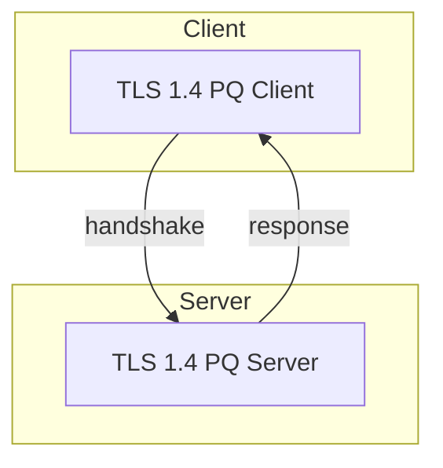

# TLS 1.4 PQ-Ready Server/Client Example

This project demonstrates a real-world handshake using TLS 1.4 and hybrid post-quantum cryptography (stubbed for demo, ready for python-oqs integration). It includes a Python server and client, Docker support, and logging for handshake events.

## Features
- TLS 1.4 handshake (Python, OpenSSL backend)
- Hybrid PQ-ready (extend with python-oqs or custom OpenSSL)
- Real server and client with logging
- Dockerized for easy testing
- Simple self-signed certs (replace for production)

## Usage

### Build and Run (Docker Compose)

```bash
sudo docker compose build
sudo docker compose up
```

- The server will listen on port 8443.
- The client will connect, perform a handshake, and print the server's message.
- Handshake logs are written to `server/server_handshake.log` and `client/client_handshake.log`.

### Manual Run (Python)

```bash
# In one terminal:
cd server && python server.py
# In another terminal:
cd client && python client.py
```

## Architecture



## Extending for Real PQ
- Replace the SSL context with python-oqs or a hybrid OpenSSL build for true PQ/hybrid support.
- Update certs and ciphersuites as needed.

## License
MIT
